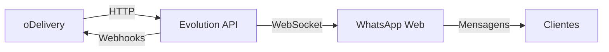
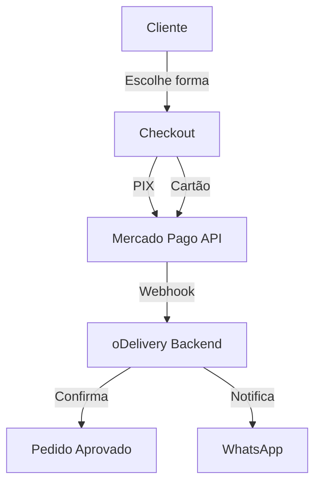

# Plano Estratégico de Melhorias - Sistema oDelivery

> **Documento de Planejamento Completo**  
> Data: 25/01/2026  
> Versão: 1.0

---

## 📋 Sumário Executivo

Este documento apresenta um plano abrangente para profissionalizar e expandir o sistema oDelivery, focando em três pilares fundamentais:

1. **Segurança do Sistema** - Hardening completo da aplicação
2. **Integração Evolution API** - WhatsApp Business automatizado
3. **Gateway Mercado Pago** - Pagamentos online seguros

---

## 🎯 Objetivos Estratégicos

### Curto Prazo (1-2 meses)
- ✅ Implementar autenticação 2FA para admin
- ✅ Configurar Evolution API funcional
- ✅ Integrar Mercado Pago básico (PIX + Cartão)
- ✅ Audit logs completo

### Médio Prazo (3-4 meses)
- 📊 Dashboard analytics avançado
- 🔐 Compliance LGPD
- 💳 Assinaturas recorrentes via Mercado Pago
- 📱 Notificações WhatsApp automatizadas

### Longo Prazo (5-6 meses)
- 🤖 Chatbot WhatsApp com IA
- 📈 Sistema de métricas e BI
- 🌐 Multi-idioma
- 🔄 Integrações com iFood/Rappi

---

## 🔒 Parte 1: Segurança do Sistema

### 1.1 Autenticação e Autorização

#### **Implementar 2FA (Two-Factor Authentication)**

**Arquivos a criar:**
```
app/Services/TwoFactorService.php
app/Http/Controllers/TwoFactorController.php
database/migrations/xxxx_add_two_factor_to_users.php
resources/js/Pages/Auth/TwoFactorChallenge.tsx
```

**Campos necessários na tabela `users`:**
```sql
two_factor_secret TEXT NULL
two_factor_recovery_codes TEXT NULL
two_factor_confirmed_at TIMESTAMP NULL
```

**Bibliotecas:**
- `pragmarx/google2fa-laravel` - Geração de códigos TOTP
- `bacon/bacon-qr-code` - QR codes para configuração

**Fluxo de implementação:**
1. Usuário ativa 2FA nas configurações
2. Sistema gera secret key + QR code
3. Usuário escaneia com Google Authenticator
4. Sistema valida código de confirmação
5. Gera 8 recovery codes (uso único)
6. Login passa a exigir código 2FA

---

#### **Rate Limiting Avançado**

**Criar middleware personalizado:**
```php
// app/Http/Middleware/ThrottleRequests.php
- Login: 5 tentativas / 1 minuto
- API: 60 requisições / 1 minuto
- Admin: 100 requisições / 1 minuto
- Webhooks: 1000 requisições / 1 minuto
```

**Implementar IP Blacklist:**
```php
// app/Services/SecurityService.php
- Bloquear IPs após 10 falhas consecutivas
- Whitelist para IPs confiáveis
- Logs de tentativas suspeitas
```

---

#### **RBAC (Role-Based Access Control)**

**Estrutura de permissões:**
```
Super Admin
├── Gerenciar Tenants
├── Ver Logs do Sistema
├── Configurar API Keys
└── Acessar Métricas Globais

Tenant Owner
├── Gerenciar Produtos
├── Ver Pedidos
├── Configurar Loja
└── Gerenciar Funcionários

Funcionário (Cozinha)
├── Ver Pedidos Pendentes
├── Atualizar Status
└── Marcar como Pronto

Funcionário (Entrega)
├── Ver Pedidos para Entrega
└── Atualizar Localização
```

**Implementação:**
```bash
composer require spatie/laravel-permission
php artisan vendor:publish --provider="Spatie\Permission\PermissionServiceProvider"
```

---

### 1.2 Proteção de Dados

#### **Criptografia de Dados Sensíveis**

**Campos a criptografar:**
- CPF/CNPJ dos clientes
- Telefones
- Endereços completos
- Tokens de API (Evolution, Mercado Pago)
- Credenciais de WhatsApp

**Implementação:**
```php
// app/Models/Customer.php
use Illuminate\Database\Eloquent\Casts\Attribute;

protected function phone(): Attribute
{
    return Attribute::make(
        get: fn ($value) => decrypt($value),
        set: fn ($value) => encrypt($value),
    );
}
```

---

#### **LGPD Compliance**

**Funcionalidades necessárias:**

1. **Consentimento explícito**
   - Checkbox de aceite de termos
   - Política de privacidade clara
   - Opt-in para marketing

2. **Direito ao esquecimento**
   ```php
   // app/Http/Controllers/GdprController.php
   public function deleteAccount(Request $request)
   {
       // Anonimizar dados ao invés de deletar
       // Manter histórico de pedidos (sem dados pessoais)
   }
   ```

3. **Exportação de dados**
   ```php
   public function exportData(Request $request)
   {
       // Gerar JSON/PDF com todos os dados do usuário
   }
   ```

4. **Logs de acesso**
   - Registrar quem acessou dados pessoais
   - Quando e por qual motivo

---

### 1.3 Audit Logs

#### **Sistema de Auditoria Completo**

**Eventos a registrar:**
```php
// config/audit.php
'events' => [
    'user.login',
    'user.logout',
    'user.failed_login',
    'user.password_reset',
    'tenant.created',
    'tenant.suspended',
    'order.created',
    'order.cancelled',
    'product.price_changed',
    'settings.updated',
    'api_key.created',
    'api_key.revoked',
]
```

**Tabela de audit_logs:**
```sql
CREATE TABLE audit_logs (
    id UUID PRIMARY KEY,
    user_id UUID NULL,
    tenant_id UUID NULL,
    event VARCHAR(255) NOT NULL,
    auditable_type VARCHAR(255) NULL,
    auditable_id UUID NULL,
    old_values JSON NULL,
    new_values JSON NULL,
    ip_address VARCHAR(45) NULL,
    user_agent TEXT NULL,
    created_at TIMESTAMP
);
```

**Biblioteca recomendada:**
```bash
composer require owen-it/laravel-auditing
```

---

### 1.4 Proteção contra Ataques

#### **SQL Injection**
- ✅ Usar Eloquent ORM (já implementado)
- ✅ Prepared statements sempre
- ⚠️ Validar inputs com FormRequests

#### **XSS (Cross-Site Scripting)**
```php
// Sanitizar inputs
use Illuminate\Support\Str;

$clean = Str::of($input)->stripTags()->trim();
```

#### **CSRF Protection**
- ✅ Tokens CSRF em todos os forms (já implementado via Inertia)
- Validar origin headers em APIs

#### **DDoS Protection**
```nginx
# nginx.conf
limit_req_zone $binary_remote_addr zone=one:10m rate=10r/s;
limit_conn_zone $binary_remote_addr zone=addr:10m;

location / {
    limit_req zone=one burst=20 nodelay;
    limit_conn addr 10;
}
```

---

## 📱 Parte 2: Evolution API - Integração WhatsApp

### 2.1 Arquitetura da Integração



### 2.2 Funcionalidades a Implementar

#### **2.2.1 Gerenciamento de Instâncias**

**Controller: `WhatsAppInstanceController.php`**

```php
// Criar instância
POST /api/whatsapp/instances
{
    "name": "loja-centro",
    "tenant_id": "uuid"
}

// Listar instâncias
GET /api/whatsapp/instances

// Conectar (obter QR Code)
GET /api/whatsapp/instances/{id}/qrcode

// Status da conexão
GET /api/whatsapp/instances/{id}/status

// Desconectar
POST /api/whatsapp/instances/{id}/disconnect

// Deletar
DELETE /api/whatsapp/instances/{id}
```

**Modelo: `WhatsAppInstance.php`**
```php
protected $fillable = [
    'tenant_id',
    'instance_name',
    'phone_number',
    'status', // 'disconnected', 'connecting', 'connected'
    'qr_code',
    'last_connected_at',
    'settings',
];

protected $casts = [
    'settings' => 'array',
    'last_connected_at' => 'datetime',
];
```

---

#### **2.2.2 Envio de Mensagens**

**Service: `WhatsAppMessageService.php`**

```php
class WhatsAppMessageService
{
    public function sendOrderConfirmation(Order $order)
    {
        $message = "🎉 *Pedido Confirmado!*\n\n";
        $message .= "Número: #{$order->id}\n";
        $message .= "Total: R$ " . number_format($order->total, 2) . "\n";
        $message .= "Tempo estimado: {$order->estimated_time} min\n\n";
        $message .= "Obrigado pela preferência! 🍕";
        
        return $this->evolutionApi->sendTextMessage(
            $order->tenant->whatsapp_instance,
            $order->customer->phone,
            $message
        );
    }
    
    public function sendOrderReady(Order $order)
    {
        $message = "✅ *Pedido Pronto!*\n\n";
        $message .= "Seu pedido #{$order->id} está pronto ";
        $message .= $order->mode === 'delivery' 
            ? "e saiu para entrega! 🛵" 
            : "para retirada! 🏪";
        
        return $this->evolutionApi->sendTextMessage(
            $order->tenant->whatsapp_instance,
            $order->customer->phone,
            $message
        );
    }
}
```

**Eventos a notificar:**
- ✅ Pedido recebido
- ✅ Pedido confirmado
- ✅ Em preparo
- ✅ Saiu para entrega
- ✅ Pedido entregue
- ⚠️ Pedido atrasado
- ❌ Pedido cancelado

---

#### **2.2.3 Webhooks (Receber Mensagens)**

**Controller: `WhatsAppWebhookController.php`**

```php
public function handleIncoming(Request $request)
{
    $data = $request->all();
    
    // Validar assinatura do webhook
    if (!$this->validateWebhookSignature($request)) {
        return response()->json(['error' => 'Invalid signature'], 401);
    }
    
    // Processar mensagem
    match($data['event']) {
        'messages.upsert' => $this->handleNewMessage($data),
        'connection.update' => $this->handleConnectionUpdate($data),
        'qr.updated' => $this->handleQrUpdate($data),
        default => null,
    };
    
    return response()->json(['status' => 'ok']);
}
```

**Funcionalidades do chatbot:**
```
Cliente: "Oi"
Bot: "Olá! 👋 Como posso ajudar?\n1️⃣ Ver cardápio\n2️⃣ Fazer pedido\n3️⃣ Rastrear pedido\n4️⃣ Falar com atendente"

Cliente: "1"
Bot: "📋 Nosso cardápio:\n[Link do cardápio]"

Cliente: "3"
Bot: "Digite o número do seu pedido:"

Cliente: "#12345"
Bot: "Pedido #12345\nStatus: Em preparo 🍳\nTempo estimado: 15 min"
```

---

#### **2.2.4 Interface Admin**

**Página: `resources/js/Pages/Settings/WhatsApp.tsx`**

**Componentes:**
- Card de status da conexão (verde/vermelho)
- QR Code para conectar
- Botão "Reconectar"
- Histórico de mensagens enviadas
- Configurações de mensagens automáticas
- Templates de mensagens personalizáveis

---

### 2.3 Configuração Evolution API

**Arquivo: `config/services.php`**
```php
'evolution' => [
    'url' => env('EVOLUTION_API_URL', 'http://localhost:8080'),
    'api_key' => env('EVOLUTION_API_KEY'),
    'webhook_url' => env('APP_URL') . '/webhooks/whatsapp',
],
```

**Variáveis de ambiente:**
```env
EVOLUTION_API_URL=https://evolution.seudominio.com
EVOLUTION_API_KEY=sua_chave_secreta_aqui
```

---

## 💳 Parte 3: Mercado Pago Integration

### 3.1 Arquitetura de Pagamentos



### 3.2 Métodos de Pagamento

#### **3.2.1 PIX**

**Fluxo:**
1. Cliente finaliza pedido
2. Backend gera QR Code PIX via Mercado Pago
3. Cliente escaneia e paga
4. Webhook notifica pagamento aprovado
5. Pedido é confirmado automaticamente

**Implementação:**
```php
// app/Services/MercadoPagoService.php
public function createPixPayment(Order $order)
{
    $payment = [
        'transaction_amount' => $order->total,
        'description' => "Pedido #{$order->id}",
        'payment_method_id' => 'pix',
        'payer' => [
            'email' => $order->customer->email,
            'first_name' => $order->customer->name,
        ],
        'notification_url' => route('webhooks.mercadopago'),
        'metadata' => [
            'order_id' => $order->id,
            'tenant_id' => $order->tenant_id,
        ],
    ];
    
    $response = Http::withToken($this->accessToken)
        ->post('https://api.mercadopago.com/v1/payments', $payment);
    
    return [
        'qr_code' => $response['point_of_interaction']['transaction_data']['qr_code'],
        'qr_code_base64' => $response['point_of_interaction']['transaction_data']['qr_code_base64'],
        'payment_id' => $response['id'],
    ];
}
```

---

#### **3.2.2 Cartão de Crédito**

**Fluxo:**
1. Cliente insere dados do cartão (frontend)
2. Frontend tokeniza com Mercado Pago.js
3. Backend recebe token e processa pagamento
4. Retorna aprovação/recusa

**Frontend (React):**
```tsx
import { loadMercadoPago } from '@mercadopago/sdk-js';

const mp = await loadMercadoPago();
const cardForm = mp.cardForm({
    amount: order.total,
    iframe: true,
    form: {
        id: 'form-checkout',
        cardNumber: { id: 'form-checkout__cardNumber' },
        expirationDate: { id: 'form-checkout__expirationDate' },
        securityCode: { id: 'form-checkout__securityCode' },
        cardholderName: { id: 'form-checkout__cardholderName' },
        issuer: { id: 'form-checkout__issuer' },
        installments: { id: 'form-checkout__installments' },
        identificationType: { id: 'form-checkout__identificationType' },
        identificationNumber: { id: 'form-checkout__identificationNumber' },
    },
    callbacks: {
        onFormMounted: error => {
            if (error) console.error(error);
        },
        onSubmit: event => {
            event.preventDefault();
            const { paymentMethodId, issuerId, cardholderEmail, amount, token, installments } = cardForm.getCardFormData();
            
            // Enviar para backend
            fetch('/api/payments/process', {
                method: 'POST',
                body: JSON.stringify({
                    token,
                    payment_method_id: paymentMethodId,
                    installments,
                    order_id: order.id,
                }),
            });
        },
    },
});
```

**Backend:**
```php
public function processCardPayment(Request $request)
{
    $payment = [
        'transaction_amount' => $request->amount,
        'token' => $request->token,
        'installments' => $request->installments,
        'payment_method_id' => $request->payment_method_id,
        'payer' => [
            'email' => $request->email,
        ],
    ];
    
    $response = Http::withToken($this->accessToken)
        ->post('https://api.mercadopago.com/v1/payments', $payment);
    
    if ($response['status'] === 'approved') {
        $order->update([
            'payment_status' => 'paid',
            'payment_id' => $response['id'],
        ]);
    }
    
    return $response;
}
```

---

#### **3.2.3 Assinaturas Recorrentes**

**Para planos de assinatura dos tenants:**

```php
public function createSubscription(Tenant $tenant, string $planId)
{
    $subscription = [
        'reason' => "Assinatura Plano {$planId}",
        'auto_recurring' => [
            'frequency' => 1,
            'frequency_type' => 'months',
            'transaction_amount' => $this->getPlanPrice($planId),
            'currency_id' => 'BRL',
        ],
        'back_url' => route('subscription.callback'),
        'payer_email' => $tenant->owner->email,
    ];
    
    $response = Http::withToken($this->accessToken)
        ->post('https://api.mercadopago.com/preapproval', $subscription);
    
    return $response['init_point']; // URL para checkout
}
```

---

### 3.3 Webhooks Mercado Pago

**Controller: `MercadoPagoWebhookController.php`**

```php
public function handle(Request $request)
{
    // Validar assinatura
    $signature = $request->header('x-signature');
    if (!$this->validateSignature($signature, $request->getContent())) {
        return response()->json(['error' => 'Invalid signature'], 401);
    }
    
    $data = $request->all();
    
    match($data['type']) {
        'payment' => $this->handlePayment($data['data']['id']),
        'subscription' => $this->handleSubscription($data['data']['id']),
        default => null,
    };
    
    return response()->json(['status' => 'ok']);
}

private function handlePayment(string $paymentId)
{
    $payment = Http::withToken($this->accessToken)
        ->get("https://api.mercadopago.com/v1/payments/{$paymentId}")
        ->json();
    
    $order = Order::where('payment_id', $paymentId)->first();
    
    if ($payment['status'] === 'approved') {
        $order->update(['payment_status' => 'paid']);
        
        // Enviar notificação WhatsApp
        event(new OrderPaid($order));
    }
}
```

**Eventos de pagamento:**
- `payment.created` - Pagamento iniciado
- `payment.updated` - Status atualizado
- `payment.approved` - Pagamento aprovado ✅
- `payment.rejected` - Pagamento recusado ❌
- `payment.refunded` - Estorno realizado

---

### 3.4 Interface de Pagamentos

**Página: `resources/js/Pages/Checkout/Payment.tsx`**

**Componentes:**
- Seletor de método (PIX / Cartão / Dinheiro)
- Formulário de cartão (Mercado Pago.js)
- QR Code PIX com countdown
- Status do pagamento em tempo real
- Botão "Copiar código PIX"

---

## 📊 Parte 4: Melhorias no Painel Admin

### 4.1 Dashboard Analytics

**Métricas a exibir:**

```typescript
interface DashboardMetrics {
    // Tenants
    totalTenants: number;
    activeTenants: number;
    trialTenants: number;
    churnRate: number;
    
    // Financeiro
    mrr: number; // Monthly Recurring Revenue
    arr: number; // Annual Recurring Revenue
    totalRevenue: number;
    pendingPayments: number;
    
    // Sistema
    totalOrders: number;
    ordersToday: number;
    averageOrderValue: number;
    apiUptime: number;
    
    // WhatsApp
    messagesS sent: number;
    activeInstances: number;
    connectionErrors: number;
}
```

**Gráficos:**
- 📈 Crescimento de tenants (linha)
- 💰 Receita mensal (barra)
- 🍕 Pedidos por dia da semana (barra)
- 📱 Taxa de conversão WhatsApp (funil)
- ⚡ Performance da API (linha)

**Biblioteca recomendada:**
```bash
npm install recharts
```

---

### 4.2 Gerenciamento de Tenants

**Funcionalidades:**

1. **Visualização detalhada**
   - Informações da loja
   - Plano atual e histórico
   - Métricas de uso (pedidos, produtos, clientes)
   - Logs de atividade

2. **Ações administrativas**
   - Suspender/Reativar
   - Alterar plano manualmente
   - Resetar senha do owner
   - Acessar como tenant (impersonation)

3. **Suporte**
   - Chat interno
   - Histórico de tickets
   - Notas administrativas

---

### 4.3 Monitoramento de API Keys

**Tabela: `api_credentials`**

```sql
CREATE TABLE api_credentials (
    id UUID PRIMARY KEY,
    tenant_id UUID NULL,
    service VARCHAR(50) NOT NULL, -- 'evolution', 'mercadopago'
    key_name VARCHAR(255) NOT NULL,
    api_key TEXT NOT NULL, -- encrypted
    api_secret TEXT NULL, -- encrypted
    is_active BOOLEAN DEFAULT true,
    last_used_at TIMESTAMP NULL,
    expires_at TIMESTAMP NULL,
    created_at TIMESTAMP,
    updated_at TIMESTAMP
);
```

**Interface:**
- Listar todas as keys
- Criar nova key
- Revogar key
- Ver logs de uso
- Alertas de expiração

---

### 4.4 Logs e Auditoria

**Página: `resources/js/Pages/Admin/Logs.tsx`**

**Filtros:**
- Por usuário
- Por tenant
- Por tipo de evento
- Por data
- Por IP

**Exportação:**
- CSV
- JSON
- PDF (relatório)

---

## 🚀 Roadmap de Implementação

### **Sprint 1 (Semana 1-2): Segurança**
- [ ] Implementar 2FA
- [ ] Rate limiting avançado
- [ ] Audit logs básico
- [ ] Criptografia de dados sensíveis

### **Sprint 2 (Semana 3-4): Evolution API**
- [ ] CRUD de instâncias WhatsApp
- [ ] Envio de mensagens básico
- [ ] Webhooks para receber mensagens
- [ ] Interface de gerenciamento

### **Sprint 3 (Semana 5-6): Mercado Pago**
- [ ] Integração PIX
- [ ] Integração Cartão
- [ ] Webhooks de pagamento
- [ ] Interface de checkout

### **Sprint 4 (Semana 7-8): Admin Panel**
- [ ] Dashboard analytics
- [ ] Gerenciamento de tenants
- [ ] Logs e auditoria
- [ ] Monitoramento de APIs

### **Sprint 5 (Semana 9-10): Automações**
- [ ] Notificações WhatsApp automáticas
- [ ] Chatbot básico
- [ ] Assinaturas recorrentes
- [ ] Relatórios automatizados

### **Sprint 6 (Semana 11-12): Testes e Deploy**
- [ ] Testes de integração
- [ ] Testes de segurança
- [ ] Documentação
- [ ] Deploy em produção

---

## 🧪 Estratégia de Testes

### Testes Unitários
```bash
php artisan test --filter=TwoFactorTest
php artisan test --filter=MercadoPagoServiceTest
php artisan test --filter=WhatsAppMessageServiceTest
```

### Testes de Integração
- Evolution API: Criar instância → Conectar → Enviar mensagem
- Mercado Pago: Criar pagamento → Webhook → Confirmar pedido
- Fluxo completo: Pedido → Pagamento → WhatsApp → Entrega

### Testes de Segurança
- Penetration testing (OWASP Top 10)
- SQL Injection attempts
- XSS attempts
- CSRF bypass attempts
- Rate limiting validation

---

## 📚 Documentação Necessária

### Para Desenvolvedores
- [ ] API Reference (Swagger/OpenAPI)
- [ ] Guia de contribuição
- [ ] Arquitetura do sistema
- [ ] Fluxos de dados

### Para Usuários
- [ ] Manual do admin
- [ ] Guia de configuração WhatsApp
- [ ] Guia de configuração Mercado Pago
- [ ] FAQ

### Para Suporte
- [ ] Troubleshooting guide
- [ ] Procedimentos de emergência
- [ ] Contatos de escalação

---

## 💰 Estimativa de Custos

### Infraestrutura
- Evolution API (VPS): R$ 50/mês
- Mercado Pago: 4.99% + R$ 0.49 por transação
- SSL Certificates: Grátis (Let's Encrypt)
- Backup storage: R$ 20/mês

### Desenvolvimento
- 12 semanas × 40h/semana = 480 horas
- Estimativa: R$ 100-150/hora
- **Total: R$ 48.000 - R$ 72.000**

### Manutenção Mensal
- Monitoramento: R$ 200/mês
- Suporte: R$ 500/mês
- **Total: R$ 700/mês**

---

## ⚠️ Riscos e Mitigações

| Risco | Probabilidade | Impacto | Mitigação |
|-------|---------------|---------|-----------|
| Evolution API instável | Média | Alto | Implementar fallback SMS, monitoramento 24/7 |
| Webhook Mercado Pago falha | Baixa | Alto | Polling de status, retry automático |
| Ataque DDoS | Média | Alto | Cloudflare, rate limiting |
| Vazamento de dados | Baixa | Crítico | Criptografia, audit logs, backups |
| Indisponibilidade WhatsApp | Alta | Médio | Notificações por email/SMS alternativas |

---

## 📞 Próximos Passos

1. **Revisar este documento** com a equipe
2. **Priorizar funcionalidades** (MoSCoW)
3. **Definir arquitetura detalhada** de cada módulo
4. **Criar tasks no Jira/Trello**
5. **Iniciar Sprint 1**

---

## 📝 Notas Finais

Este plano é um documento vivo e deve ser atualizado conforme:
- Feedback dos usuários
- Mudanças nas APIs (Evolution, Mercado Pago)
- Novas regulamentações (LGPD, PCI-DSS)
- Evolução do mercado

**Última atualização:** 25/01/2026  
**Responsável:** Equipe de Desenvolvimento oDelivery
